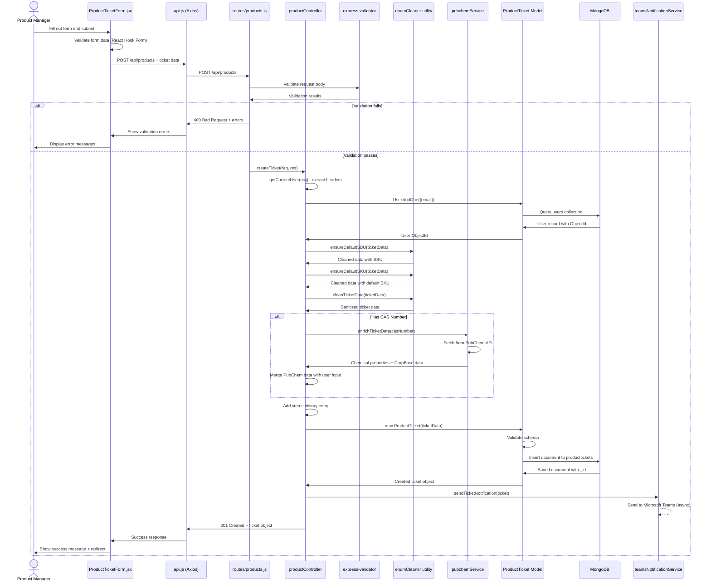
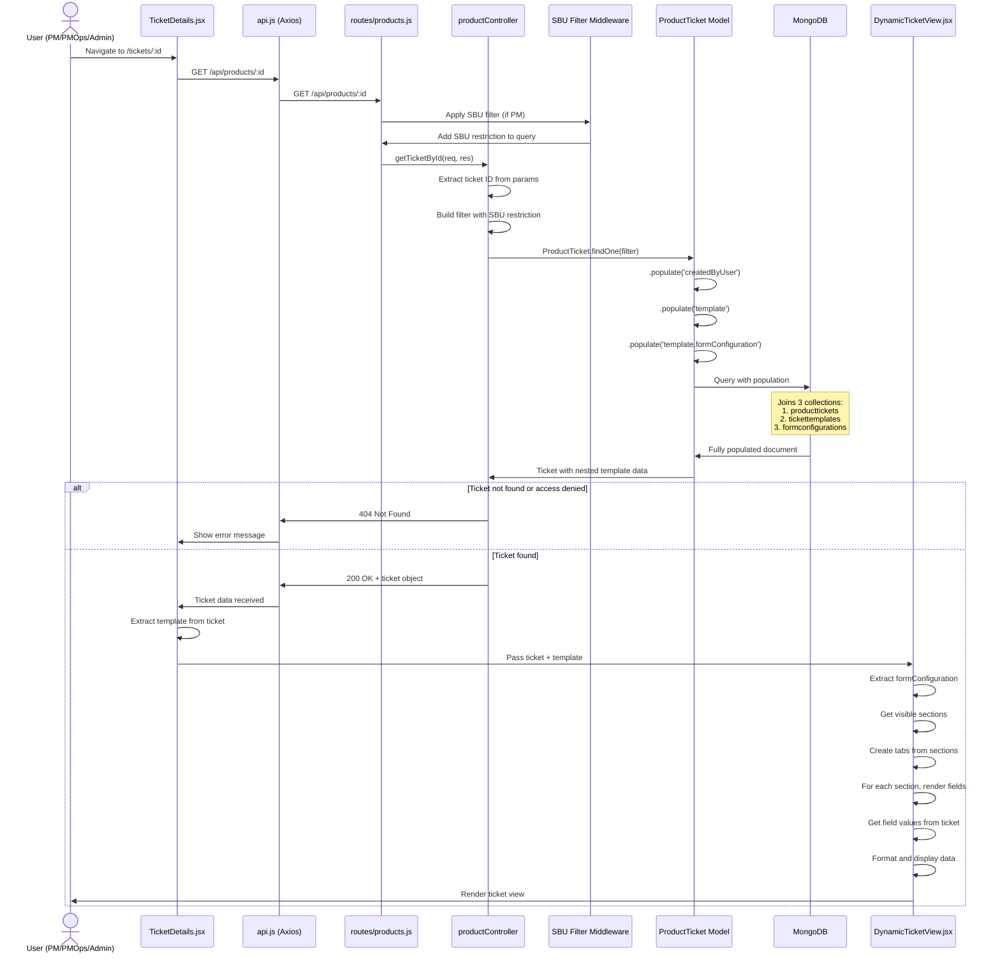

# Ticket Data Flow Architecture

This document provides detailed diagrams showing how models, routes, controllers, and services interact when creating and viewing tickets in the NPDI application.

## Table of Contents

1. [System Architecture Overview](#system-architecture-overview)
2. [Creating a New Ticket](#creating-a-new-ticket)
3. [Viewing a Submitted Ticket](#viewing-a-submitted-ticket)
4. [Database Schema Relationships](#database-schema-relationships)
5. [Component Interaction Matrix](#component-interaction-matrix)

---

## System Architecture Overview

```
┌─────────────────────────────────────────────────────────────────────┐
│                         FRONTEND (React)                            │
│  ┌──────────────────┐  ┌──────────────────┐  ┌─────────────────┐  │
│  │ ProductTicketForm│  │  TicketDetails   │  │ DynamicTicketView│ │
│  │   (Create/Edit)  │  │   (View Page)    │  │  (Render View)   │ │
│  └────────┬─────────┘  └────────┬─────────┘  └────────┬─────────┘  │
│           │                     │                     │             │
│           └─────────────────────┴─────────────────────┘             │
│                                 │                                   │
│                        ┌────────▼────────┐                          │
│                        │   api.js Client │                          │
│                        │  (Axios Client) │                          │
│                        └────────┬────────┘                          │
└─────────────────────────────────┼───────────────────────────────────┘
                                  │ HTTP Requests
                                  │
┌─────────────────────────────────▼───────────────────────────────────┐
│                         BACKEND (Node.js/Express)                   │
│  ┌──────────────────────────────────────────────────────────────┐  │
│  │                       ROUTES                                 │  │
│  │  ┌────────────────┐  ┌────────────────┐  ┌────────────────┐ │  │
│  │  │ products.js    │  │ templates.js   │  │ formConfig.js  │ │  │
│  │  │ /api/products  │  │ /api/templates │  │ /api/form-config│ │  │
│  │  └───────┬────────┘  └───────┬────────┘  └───────┬────────┘ │  │
│  └──────────┼────────────────────┼────────────────────┼──────────┘  │
│             │                    │                    │             │
│  ┌──────────▼────────────────────▼────────────────────▼──────────┐  │
│  │                       CONTROLLERS                            │  │
│  │  ┌──────────────────────────────────────────────────────────┐ │  │
│  │  │         productController.js                             │ │  │
│  │  │  ┌──────────────┐  ┌──────────────┐  ┌──────────────┐  │ │  │
│  │  │  │ createTicket │  │getTicketById │  │ updateTicket │  │ │  │
│  │  │  └──────┬───────┘  └──────┬───────┘  └──────┬───────┘  │ │  │
│  │  └─────────┼──────────────────┼──────────────────┼─────────┘ │  │
│  └────────────┼──────────────────┼──────────────────┼───────────┘  │
│               │                  │                  │               │
│  ┌────────────▼──────────────────▼──────────────────▼───────────┐  │
│  │                        SERVICES                              │  │
│  │  ┌──────────────┐  ┌──────────────┐  ┌──────────────┐       │  │
│  │  │  pubchemSvc  │  │ palantirSvc  │  │ aiContentSvc │       │  │
│  │  │ (External)   │  │ (SAP MARA)   │  │ (Azure AI)   │       │  │
│  │  └──────────────┘  └──────────────┘  └──────────────┘       │  │
│  │  ┌──────────────┐  ┌──────────────┐                         │  │
│  │  │  teamsNotify │  │ enumCleaner  │                         │  │
│  │  │   Service    │  │   Utility    │                         │  │
│  │  └──────────────┘  └──────────────┘                         │  │
│  └───────────────────────────────────────────────────────────────┘  │
│               │                  │                  │               │
│  ┌────────────▼──────────────────▼──────────────────▼───────────┐  │
│  │                         MODELS (Mongoose)                    │  │
│  │  ┌──────────────┐  ┌──────────────┐  ┌──────────────┐       │  │
│  │  │ProductTicket │  │TicketTemplate│  │FormConfig    │       │  │
│  │  │   Schema     │  │   Schema     │  │  Schema      │       │  │
│  │  └──────┬───────┘  └──────┬───────┘  └──────┬───────┘       │  │
│  │         │                  │                  │               │  │
│  │  ┌──────▼──────────────────▼──────────────────▼───────┐      │  │
│  │  │              User Schema                           │      │  │
│  │  └────────────────────────────────────────────────────┘      │  │
│  └───────────────────────────────────────────────────────────────┘  │
│               │                  │                  │               │
└───────────────┼──────────────────┼──────────────────┼───────────────┘
                │                  │                  │
┌───────────────▼──────────────────▼──────────────────▼───────────────┐
│                       MONGODB DATABASE                              │
│  ┌──────────────┐  ┌──────────────┐  ┌──────────────────────┐      │
│  │producttickets│  │tickettemplates│  │formconfigurations    │      │
│  │  Collection  │  │  Collection   │  │  Collection          │      │
│  └──────────────┘  └──────────────┘  └──────────────────────┘      │
│  ┌──────────────┐                                                  │
│  │    users     │                                                  │
│  │  Collection  │                                                  │
│  └──────────────┘                                                  │
└─────────────────────────────────────────────────────────────────────┘
```

---

## Creating a New Ticket

### High-Level Flow



### Detailed Step-by-Step Breakdown

#### **Step 1: Frontend Form Submission**

**Component:** `client/src/pages/NewTicket.jsx` → `client/src/components/forms/ProductTicketForm.jsx`

```javascript
// User fills out form fields
const onSubmit = async (data) => {
  // React Hook Form validation passes
  const response = await api.post('/api/products', data);
  // Handle response
};
```

**Data Structure Sent:**
```javascript
{
  productName: "Ethanol",
  sbu: "Life Science",
  chemicalProperties: {
    casNumber: "64-17-5",
    molecularFormula: "C2H6O",
    physicalState: "Liquid"
  },
  skuVariants: [
    {
      type: "PREPACK",
      packageSize: { value: 100, unit: "mL" }
    }
  ],
  // ... more fields
}
```

#### **Step 2: API Client Request**

**File:** `client/src/services/api.js`

```javascript
export const ticketsAPI = {
  create: (ticketData) => apiClient.post('/products', ticketData)
};
```

**Headers Added:**
```javascript
headers: {
  'x-user-firstname': 'John',
  'x-user-lastname': 'Smith',
  'x-user-email': 'john.smith@milliporesigma.com',
  'x-user-role': 'PRODUCT_MANAGER'
}
```

#### **Step 3: Backend Route**

**File:** `server/routes/products.js`

```javascript
router.post('/', [
  // Validation middleware
  body('productName').notEmpty().withMessage('Product name is required').trim(),
  body('sbu').notEmpty().withMessage('SBU is required').trim(),
  body('chemicalProperties.casNumber').optional().custom(value => {
    return /^\d{1,7}-\d{2}-\d$/.test(value);
  }),
  // ... more validators
], productController.createTicket);
```

**What happens:**
1. Express-validator checks all fields
2. If validation fails → 400 error response
3. If validation passes → calls `productController.createTicket`

#### **Step 4: Controller Processing**

**File:** `server/controllers/productController.js`

```javascript
const createTicket = async (req, res) => {
  // 1. Check validation results
  const errors = validationResult(req);
  if (!errors.isEmpty()) {
    return res.status(400).json({ errors: errors.array() });
  }

  // 2. Extract user from headers
  const currentUser = getCurrentUser(req);
  // Returns: { firstName, lastName, email, role }

  // 3. Look up user in database
  const userRecord = await User.findOne({ email: currentUser.email });

  // 4. Build ticket data
  let ticketData = {
    ...req.body,
    createdBy: currentUser.email,        // String (email)
    createdByUser: userRecord?._id       // ObjectId reference
  };

  // 5. Set initial status
  if (!ticketData.status) {
    ticketData.status = 'SUBMITTED';
  }

  // 6. Clean and validate data
  ticketData = ensureDefaultSBU(ticketData, 'P90');
  ticketData = ensureDefaultSKU(ticketData);
  ticketData = cleanTicketData(ticketData);

  // 7. Auto-populate from PubChem (if CAS provided)
  if (ticketData.chemicalProperties?.casNumber) {
    const enrichedData = await pubchemService.enrichTicketData(
      ticketData.chemicalProperties.casNumber
    );
    ticketData = {
      ...ticketData,
      productName: ticketData.productName || enrichedData.productName,
      chemicalProperties: {
        ...enrichedData.chemicalProperties,
        ...ticketData.chemicalProperties // User input takes priority
      }
    };
  }

  // 8. Add creation entry to status history
  if (!ticketData.statusHistory) {
    ticketData.statusHistory = [];
  }
  ticketData.statusHistory.push({
    status: ticketData.status,
    changedBy: currentUser.email,
    changedAt: new Date(),
    reason: `Ticket created by ${currentUser.firstName} ${currentUser.lastName}`,
    action: 'TICKET_CREATED',
    userInfo: { firstName: currentUser.firstName, lastName: currentUser.lastName }
  });

  // 9. Get correct model using TicketFactory and create ticket
  const ticketType = TicketFactory.getTypeFromTemplate(userTemplate);  // 'DM1-CHEM'
  const TicketModel = TicketFactory.getModel(ticketType);
  const ticket = new TicketModel(ticketData);
  await ticket.save();

  // 10. Send Teams notification (async, don't wait)
  teamsNotificationService.sendTicketNotification(ticket);

  // 11. Return created ticket
  res.status(201).json({ ticket });
};
```

#### **Step 5: Model Validation & Database Insert**

**File:** `server/models/ProductTicket.js`

```javascript
const productTicketSchema = new mongoose.Schema({
  ticketNumber: { type: String, unique: true },
  productName: { type: String, required: true },
  sbu: { type: String, required: true },
  status: {
    type: String,
    enum: ['DRAFT', 'SUBMITTED', 'IN_PROCESS', 'NPDI_INITIATED', 'COMPLETED', 'CANCELED'],
    default: 'DRAFT'
  },
  chemicalProperties: chemicalPropertiesSchema,  // Subdocument
  skuVariants: [skuVariantSchema],              // Array of subdocuments
  createdBy: { type: String },                  // Email string
  createdByUser: {
    type: mongoose.Schema.Types.ObjectId,
    ref: 'User'                                 // Reference to User collection
  },
  // ... more fields
});

// Pre-save hook: Generate ticket number
productTicketSchema.pre('save', async function(next) {
  if (!this.ticketNumber) {
    const year = new Date().getFullYear();
    const count = await this.constructor.countDocuments({
      ticketNumber: new RegExp(`^NPDI-${year}`)
    });
    this.ticketNumber = `NPDI-${year}-${String(count + 1).padStart(4, '0')}`;
  }
  next();
});
```

**MongoDB Insert:**
```javascript
db.producttickets.insertOne({
  _id: ObjectId('6913ec0412ad17fb5863b21b'),  // Auto-generated
  ticketNumber: 'NPDI-2025-0038',             // Generated by pre-save hook
  productName: 'Ethanol',
  sbu: 'Life Science',
  status: 'SUBMITTED',
  createdBy: 'john.smith@milliporesigma.com',
  createdByUser: ObjectId('67890...'),        // User reference
  chemicalProperties: {
    _id: ObjectId('6913ec0412ad17fb5863b21c'), // Auto-generated by Mongoose
    casNumber: '64-17-5',
    molecularFormula: 'C2H6O',
    // ... more fields
  },
  skuVariants: [
    {
      _id: ObjectId('6913ec0412ad17fb5863b224'), // Auto-generated
      type: 'PREPACK',
      packageSize: { value: 100, unit: 'mL' }
    }
  ],
  createdAt: ISODate('2025-11-04T20:23:51.959Z'),
  updatedAt: ISODate('2025-11-04T20:23:51.959Z')
})
```

#### **Step 6: Response & Notification**

**Teams Notification (Async):**
```javascript
// teamsNotificationService.js
await axios.post(webhookUrl, {
  "@type": "MessageCard",
  "title": "New Ticket Created",
  "text": `Ticket ${ticket.ticketNumber} created by ${user.firstName}`,
  // ... more fields
});
```

**Response to Frontend:**
```javascript
res.status(201).json({
  ticket: {
    _id: "6913ec0412ad17fb5863b21b",
    ticketNumber: "NPDI-2025-0038",
    productName: "Ethanol",
    status: "SUBMITTED",
    // ... full ticket object
  }
});
```

---

## Viewing a Submitted Ticket

### High-Level Flow



### Detailed Step-by-Step Breakdown

#### **Step 1: Frontend Navigation**

**Component:** `client/src/pages/TicketDetails.jsx`

```javascript
const TicketDetails = () => {
  const { id } = useParams();  // Get ticket ID from URL

  useEffect(() => {
    fetchTicket();
  }, [id]);

  const fetchTicket = async () => {
    const response = await api.get(`/api/products/${id}`);
    setTicket(response.data.ticket);
  };
};
```

**URL:** `/tickets/6913ec0412ad17fb5863b21b`

#### **Step 2: API Request**

**File:** `client/src/services/api.js`

```javascript
export const ticketsAPI = {
  getById: (id) => apiClient.get(`/products/${id}`)
};
```

**Request:**
```
GET /api/products/6913ec0412ad17fb5863b21b
Headers:
  x-user-email: john.smith@milliporesigma.com
  x-user-role: PRODUCT_MANAGER
```

#### **Step 3: Backend Route with SBU Filter**

**File:** `server/routes/products.js`

```javascript
router.get('/:id', productController.getTicketById);
```

**Middleware Applied (from index.js):**
```javascript
app.use('/api/products', authenticateProfile, applySBUFilter, productRoutes);
```

**SBU Filter Middleware:**
```javascript
const applySBUFilter = (req, res, next) => {
  const userRole = req.headers['x-user-role'];
  const userSBU = req.headers['x-user-sbu'];

  if (userRole === 'PRODUCT_MANAGER' && userSBU) {
    req.sbuFilter = { sbu: userSBU };  // Restrict to user's SBU
  } else {
    req.sbuFilter = {};  // PMOps and Admin see all
  }
  next();
};
```

#### **Step 4: Controller with Population**

**File:** `server/controllers/productController.js`

```javascript
const getTicketById = async (req, res) => {
  try {
    const { id } = req.params;

    // Build filter with SBU restriction
    let filter = { _id: id, ...req.sbuFilter };
    // For PM in Life Science: { _id: id, sbu: "Life Science" }
    // For PMOps/Admin: { _id: id }

    // Fetch ticket with populated references
    const ticket = await ProductTicket.findOne(filter)
      .populate('createdByUser', 'firstName lastName email')  // Populate User
      .populate({
        path: 'template',              // Populate TicketTemplate
        populate: {
          path: 'formConfiguration'    // Then populate FormConfiguration
        }
      });

    if (!ticket) {
      return res.status(404).json({
        message: 'Ticket not found or access denied'
      });
    }

    res.json({ ticket });
  } catch (error) {
    console.error('Get ticket error:', error);
    res.status(500).json({ message: 'Server error while fetching ticket' });
  }
};
```

#### **Step 5: MongoDB Population (Joins)**

**What Mongoose Does:**

1. **First Query** - Find the ticket:
```javascript
db.producttickets.findOne({
  _id: ObjectId('6913ec0412ad17fb5863b21b'),
  sbu: 'Life Science'  // If PM user
})
```

Returns:
```javascript
{
  _id: ObjectId('6913ec0412ad17fb5863b21b'),
  ticketNumber: 'NPDI-2025-0038',
  productName: 'Ethanol',
  createdBy: 'john.smith@milliporesigma.com',
  createdByUser: ObjectId('67890abc...'),      // ← Reference to users
  template: ObjectId('68ed383ff8564e1aa87b140c'),  // ← Reference to tickettemplates
  chemicalProperties: { ... },
  // ... all ticket data
}
```

2. **Second Query** - Populate User:
```javascript
db.users.findOne({
  _id: ObjectId('67890abc...')
}, {
  firstName: 1,
  lastName: 1,
  email: 1
})
```

Returns:
```javascript
{
  _id: ObjectId('67890abc...'),
  firstName: 'John',
  lastName: 'Smith',
  email: 'john.smith@milliporesigma.com'
}
```

3. **Third Query** - Populate TicketTemplate:
```javascript
db.tickettemplates.findOne({
  _id: ObjectId('68ed383ff8564e1aa87b140c')
})
```

Returns:
```javascript
{
  _id: ObjectId('68ed383ff8564e1aa87b140c'),
  name: 'DM1-CHEM-1.10.0',
  description: 'Default ticket template',
  formConfiguration: ObjectId('68ed383f2e47fd06176cb36d'),  // ← Reference
  isDefault: true,
  isActive: true
}
```

4. **Fourth Query** - Populate FormConfiguration:
```javascript
db.formconfigurations.findOne({
  _id: ObjectId('68ed383f2e47fd06176cb36d')
})
```

Returns:
```javascript
{
  _id: ObjectId('68ed383f2e47fd06176cb36d'),
  name: 'DM1-CHEM-1.10.0',
  version: '1.10.0',
  sections: [
    {
      sectionKey: 'basic',
      name: 'Basic Information',
      visible: true,
      fields: [
        {
          fieldKey: 'productName',
          label: 'Product Name',
          type: 'text',
          visible: true,
          editable: true
        },
        // ... more fields
      ]
    },
    // ... more sections
  ]
}
```

**Final Populated Result Sent to Frontend:**
```javascript
{
  ticket: {
    _id: ObjectId('6913ec0412ad17fb5863b21b'),
    ticketNumber: 'NPDI-2025-0038',
    productName: 'Ethanol',
    sbu: 'Life Science',
    status: 'SUBMITTED',
    createdBy: 'john.smith@milliporesigma.com',

    // ✅ Populated User
    createdByUser: {
      _id: ObjectId('67890abc...'),
      firstName: 'John',
      lastName: 'Smith',
      email: 'john.smith@milliporesigma.com'
    },

    // ✅ Populated Template with nested FormConfiguration
    template: {
      _id: ObjectId('68ed383ff8564e1aa87b140c'),
      name: 'DM1-CHEM-1.10.0',
      description: 'Default ticket template',
      isDefault: true,

      // ✅ Nested FormConfiguration
      formConfiguration: {
        _id: ObjectId('68ed383f2e47fd06176cb36d'),
        name: 'DM1-CHEM-1.10.0',
        version: '1.10.0',
        sections: [ /* ... */ ]
      }
    },

    // All ticket data
    chemicalProperties: { ... },
    skuVariants: [ ... ],
    // ...
  }
}
```

#### **Step 6: Frontend Rendering**

**Component:** `client/src/components/DynamicTicketView.jsx`

```javascript
const DynamicTicketView = ({ ticket, template }) => {
  // Extract form configuration
  const formConfig = template.formConfiguration;

  // Get visible sections, sorted by order
  const visibleSections = formConfig.sections
    .filter(section => section.visible !== false)
    .sort((a, b) => (a.order || 0) - (b.order || 0));

  // Create tabs from sections
  const tabs = visibleSections.map(section => ({
    id: section.sectionKey,
    name: section.name
  }));

  // For each section, render fields
  return (
    <div>
      {visibleSections.map(section => (
        <div key={section.sectionKey}>
          <h3>{section.name}</h3>
          {section.fields.map(field => {
            // Get value from ticket
            const value = getFieldValue(field.fieldKey);

            return (
              <div key={field.fieldKey}>
                <label>{field.label}</label>
                <div>{formatValue(value, field)}</div>
              </div>
            );
          })}
        </div>
      ))}
    </div>
  );
};

// Get nested field value from ticket
const getFieldValue = (fieldKey) => {
  const keys = fieldKey.split('.');  // 'chemicalProperties.casNumber'
  let value = ticket;

  for (const key of keys) {
    value = value?.[key];
  }

  return value;
};

// Example:
// fieldKey = 'chemicalProperties.casNumber'
// ticket = { chemicalProperties: { casNumber: '64-17-5' } }
// Returns: '64-17-5'
```

**Rendered Output:**
```
┌─────────────────────────────────────────┐
│  Ticket: NPDI-2025-0038                 │
│  Status: SUBMITTED                      │
├─────────────────────────────────────────┤
│  [Basic Info] [Chemical] [Quality] ...  │
├─────────────────────────────────────────┤
│  Product Name:    Ethanol               │
│  SBU:             Life Science          │
│  CAS Number:      64-17-5               │
│  Molecular Formula: C2H6O               │
│  ...                                    │
└─────────────────────────────────────────┘
```

---

## Database Schema Relationships

```
┌──────────────────────────────────────────────────────────────────┐
│                    DATABASE COLLECTIONS                          │
└──────────────────────────────────────────────────────────────────┘

┌─────────────────────────┐
│   producttickets        │
│─────────────────────────│
│ _id: ObjectId           │ ◄────┐
│ ticketNumber: String    │      │
│ productName: String     │      │
│ status: String          │      │
│ createdBy: String       │      │
│ createdByUser: ObjectId │──┐   │
│ template: ObjectId      │──│───│──┐
│ chemicalProperties: {   │  │   │  │
│   _id: ObjectId         │  │   │  │  Subdocument
│   casNumber: String     │  │   │  │  (embedded)
│   molecularFormula: ... │  │   │  │
│ }                       │  │   │  │
│ skuVariants: [          │  │   │  │
│   {                     │  │   │  │
│     _id: ObjectId       │  │   │  │  Array of subdocs
│     type: String        │  │   │  │  (embedded)
│     sku: String         │  │   │  │
│   }                     │  │   │  │
│ ]                       │  │   │  │
│ quality: {              │  │   │  │
│   attributes: [...]     │  │   │  │
│ }                       │  │   │  │
└─────────────────────────┘  │   │  │
                             │   │  │
            ┌────────────────┘   │  │
            │                    │  │
            ▼                    │  │
┌─────────────────────────┐     │  │
│      users              │     │  │
│─────────────────────────│     │  │
│ _id: ObjectId           │◄────┘  │
│ firstName: String       │         │
│ lastName: String        │         │
│ email: String           │         │
│ role: String            │         │
└─────────────────────────┘         │
                                    │
                   ┌────────────────┘
                   │
                   ▼
┌─────────────────────────┐
│   tickettemplates       │
│─────────────────────────│
│ _id: ObjectId           │◄────┐
│ name: String            │     │
│ description: String     │     │
│ formConfiguration: ObjId│──┐  │
│ isDefault: Boolean      │  │  │
│ isActive: Boolean       │  │  │
│ assignedUsers: [String] │  │  │
└─────────────────────────┘  │  │
                             │  │
            ┌────────────────┘  │
            │                   │
            ▼                   │
┌─────────────────────────┐    │
│  formconfigurations     │    │
│─────────────────────────│    │
│ _id: ObjectId           │◄───┘
│ name: String            │
│ templateName: String    │
│ version: String         │
│ sections: [             │
│   {                     │
│     sectionKey: String  │
│     name: String        │
│     fields: [           │
│       {                 │
│         fieldKey: String│
│         label: String   │
│         type: String    │
│       }                 │
│     ]                   │
│   }                     │
│ ]                       │
└─────────────────────────┘

Legend:
  ──┐    Reference (ObjectId pointer)
  ◄─┘    Points to
  { }    Embedded subdocument
  [ ]    Array
```

---

## Component Interaction Matrix

### Create Ticket Flow

| Layer | Component | Receives | Processes | Outputs | Next Component |
|-------|-----------|----------|-----------|---------|----------------|
| **Frontend** | ProductTicketForm.jsx | User input | Form validation, data structuring | Ticket data object | api.js |
| **API Client** | api.js | Ticket data | Add headers, make HTTP request | POST /api/products | Route |
| **Routing** | routes/products.js | HTTP request | Run validators, route to controller | Validated request | productController |
| **Controller** | productController.createTicket | req, res | Extract user, clean data, enrich with PubChem | Ticket object | Model |
| **Service** | pubchemService | CAS number | Fetch from PubChem API | Chemical properties | Controller |
| **Service** | enumCleaner | Raw ticket data | Sanitize enums, add defaults | Clean ticket data | Controller |
| **Model** | ProductTicket | Ticket data | Validate schema, run pre-save hooks | MongoDB document | Database |
| **Database** | MongoDB | Document | Insert into producttickets | Saved document with _id | Model |
| **Service** | teamsNotificationService | Ticket object | Format Teams card, send webhook | (async, no return) | None |
| **Response** | Controller → Frontend | Saved ticket | Format response | 201 Created + ticket | Frontend |
| **Frontend** | ProductTicketForm.jsx | Response | Show success, redirect | Navigation | TicketDetails |

### View Ticket Flow

| Layer | Component | Receives | Processes | Outputs | Next Component |
|-------|-----------|----------|-----------|---------|----------------|
| **Frontend** | TicketDetails.jsx | URL param (id) | Extract ID, trigger fetch | GET /api/products/:id | api.js |
| **API Client** | api.js | Ticket ID | Add headers, make HTTP request | GET request | Route |
| **Routing** | routes/products.js | HTTP request | Apply SBU filter middleware | Request + SBU filter | Controller |
| **Middleware** | applySBUFilter | User role/SBU | Build filter based on role | req.sbuFilter | Controller |
| **Controller** | productController.getTicketById | req, res | Build query, populate refs | Query with populations | Model |
| **Model** | ProductTicket | Query filter | Execute findOne + populate | Unpopulated ticket | Database |
| **Database** | MongoDB (producttickets) | Query | Find matching document | Ticket document | Model |
| **Database** | MongoDB (users) | User ObjectId | Find user by ID | User document | Model |
| **Database** | MongoDB (tickettemplates) | Template ObjectId | Find template by ID | Template document | Model |
| **Database** | MongoDB (formconfigurations) | FormConfig ObjectId | Find config by ID | FormConfig document | Model |
| **Model** | ProductTicket | All populated data | Merge all documents | Fully populated ticket | Controller |
| **Response** | Controller → Frontend | Populated ticket | Format response | 200 OK + ticket | Frontend |
| **Frontend** | TicketDetails.jsx | Response | Extract ticket, template | State update | DynamicTicketView |
| **Frontend** | DynamicTicketView.jsx | ticket, template | Extract sections, render fields | Rendered UI | User Display |

---

## Key Takeaways

### Creating a Ticket

1. **Frontend validates** form data using React Hook Form
2. **Backend validates** again using express-validator (defense in depth)
3. **User lookup** converts email to ObjectId reference
4. **Data cleaning** ensures valid enums and defaults
5. **PubChem enrichment** auto-populates chemical data
6. **TicketFactory** gets the correct model based on user's template (e.g., `DM1-CHEM`)
7. **Pre-save hooks** generate ticket number
8. **Subdocuments** get automatic _id fields from Mongoose
9. **Teams notification** happens asynchronously

**Important**: Controllers must use `TicketFactory.getModel(ticketType)` to create tickets, not `new ProductTicket()` directly. This ensures the correct discriminator model is used based on the user's template.

### Viewing a Ticket

1. **SBU filtering** restricts Product Managers to their SBU
2. **Population** performs 3-4 database queries (joins)
3. **Nested population** gets template AND formConfiguration
4. **DynamicTicketView** interprets FormConfiguration
5. **Field rendering** uses fieldKey to extract nested data
6. **Template-driven** display adapts to form configuration

### Database Design

1. **References** use ObjectId for relationships (users, templates)
2. **Embedding** for tightly coupled data (chemical properties, SKUs)
3. **Subdocument _id** enables precise array element updates
4. **Schemas** enforce data validation at model level
5. **Middleware** (pre-save hooks) add business logic

This architecture provides:
- ✅ **Separation of concerns** (routes → controllers → models)
- ✅ **Reusability** (same models for create/read/update)
- ✅ **Flexibility** (template-driven rendering)
- ✅ **Security** (SBU filtering, validation at multiple layers)
- ✅ **Traceability** (user references, status history)
